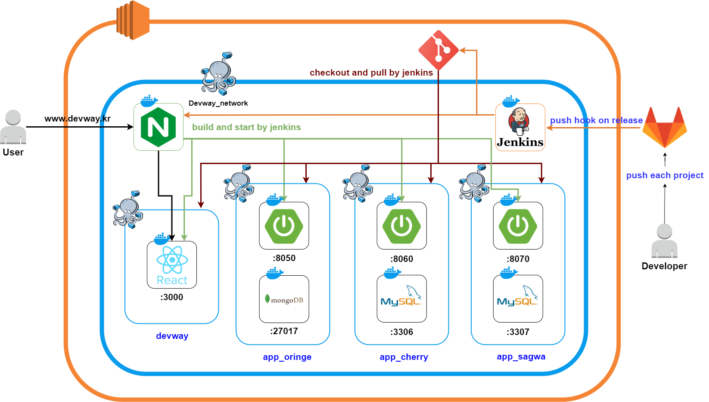

# 🛫 프로젝트 소개

**“넘쳐나는 선택지 중에 나를 위한 선택이 있다”**

데브웨이에서 넘쳐나는 여러 선택지 중에서 여러분들만의 선택을 통해 나만의 프로젝트를 만들어보아요!
<br>
혹시 필요한 기능이 데브웨이에 없다면, 저희 데브웨이에 소스를 기여해주세요!
<br>


<br>

# 🌈 기획 배경

개발자를 위한 편리한 환경을 구축하고자 많은 고민을 했습니다. 이런 고민을 해결하고자 데브웨이에서 번거로운 open API 사용을 ‘단 코드 몇 줄’로 활용할 수 있도록 소스를 개발하였습니다. 데브웨이를 통해 개발자와 여러분을 위한 최적의 개발 환경을 구축하는 데 성공하였습니다. 이로써 다양한 소스들을 조합한다면, 시간과 비용을 절약하면서 나만의 프로젝트를 쉽게 개발할 수 있을 것입니다.

<br>

# 📜와이어프레임


<br>

# 💡주요 기능

### 1️⃣ HOME

- 데브웨이 오픈소스의 릴리즈 노트입니다.
- 버전과 릴리즈 날짜를 알 수 있으며 상세 추가 사항을 확인할 수 있습니다.
- 하단의 Together us 버튼을 통해 데브웨이 레포지토리로 이동할 수 있습니다.

### 2️⃣ DEVWAY

- 데브웨이 랜딩페이지입니다.
- 가장 하단의 이동하기 버튼을 통해 데브웨이 레포지토리로 이동할 수 있습니다.


### 3️⃣ BY DEVWAY

- 데브웨이를 통해 만든 서비스를 모아놓은 페이지입니다.
- apk라면 큐알코드를 통해 다운받을 수 있으며 웹사이트라면 누르면 이동할 수 있습니다.

### 4️⃣ FAQ

- FAQ 페이지입니다.
- 자주 묻는 질문에서 질문을 누르면 해당 질문에 대한 답변을 토글 형태로 확인할 수 있습니다.
- 만약 그 외의 질문이 있다면 하단 Contact us 버튼을 통해 데브웨이 공식 이메일을 복사할 수 있습니다.

### 5️⃣ GUIDE

- 영어버전과 한국버전의 pdf 형식으로 가이드를 다운받아 볼 수 있습니다.
- 기여할 때는 기여가이드에 맞는 양식으로 MR 보내주세요! 활용 가이드를 통해 소스 활용법을 알 수 있습니다.

<br>

# 🛠 시스템 흐름도




# 📂 프로젝트 구조
```
📦DEVWAY
├─ 📂.gradle
├─ 📂.idea
├─ 📂build
├─ 📂gradle
├─ 📂src
│   └─ 📂main/java/com/ssafy/dev
│       ├─ 📂block
│       ├─ 📂blog
│       ├─ 📂book
│       ├─ 📂encyclopedia
│       ├─ 📂exchangeRate
│       ├─ 📂GPT
│       ├─ 📂image
│       ├─ 📂imageSearch
│       ├─ 📂local
│       ├─ 📂news
│       ├─ 📂STT
│       ├─ 📂text
│       ├─ 📂TTS
│       ├─ 📂typoConversion
│       ├─ 📂video
│       ├─ 📂weather
│       └─ 📜DewwayApplication.class
├─ 📂resources
├─ 📂test
├─ 📜.gitignore
├─ 📜build.gradle
├─ 📜gradlew
├─ 📜gradlew.bat
└─ 📜settings.gradle
```

<br>

# 💻역할

